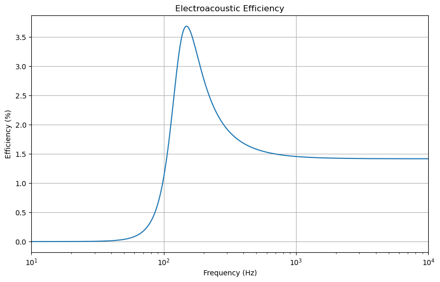

# 📢 Loudspeaker Design & Analysis


This project presents the **design, analytical modeling, and numerical simulation** of a midrange **moving coil loudspeaker**. The system is designed to reproduce speech and music in the 150 Hz – 5 kHz range with **controlled SPL**, **efficient diaphragm motion**, and **realistic cabinet modeling**.

---

## 🧰 Methodology

### 1. 📐 Mechanical & Electrical Design
- Designed key loudspeaker components: magnet, coil, diaphragm, spider, cabinet.
- Calculated **Thiele-Small Parameters** using Python scripts.

### 2. 🧮 Analytical Modelling (Python)
- Used numerical methods to compute SPL, impedance, displacement, and efficiency.
- Created graphs to visualize acoustic and electrical performance.

### 3. 📊 Numerical Simulation (COMSOL)
- Simulated magnetomechanics, pressure acoustics, and solid mechanics.
- Used Perfectly Matched Layers (PML) and mesh refinement to validate analytical results.

---

## 🎯 Design Specifications

| Parameter               | Value               | Unit         |
|------------------------|---------------------|--------------|
| **Diaphragm Material** | Polypropylene       | —            |
| **Magnet Type**        | Neodymium (B = 1 T) | —            |
| **Cabinet Volume**     | 6.91                | Litres       |
| **Diaphragm Area**     | 0.0154              | m²           |
| **Resonance Frequency**| 131.56              | Hz           |
| **BL Factor**          | 6.7                 | T·m          |
| **Total Stiffness**    | 7555.84             | N/m          |
| **Efficiency (Peak)**  | 3.5%                | —            |
| **Total Cost**         | £75                 | GBP          |

---

## 📈 Visual Analysis

### 🔊 Sound Pressure Level (SPL)

|  |
|:--:|
| *Figure: SPL across frequency (flat from 150 Hz to 5 kHz)* |

---

### 🧷 Diaphragm Displacement

|  |
|:--:|
| *Figure: Maximum displacement occurs <150 Hz, controlled at resonance* |

---

### ⚡ Electrical Impedance

|  |
|:--:|
| *Figure: Peak impedance near resonance (14 Ω), nominal 8 Ω* |

---

### 📊 Electroacoustic Efficiency

|  |
|:--:|
| *Figure: Peaks at 3.5% near 131 Hz, ~1.5% midrange typical for sealed-box drivers* |

---

### ⚙️ Real & Imaginary Parts of Impedance

|  |
|:--:|
| *Figure: Real and imaginary parts of impedance — shows energy dissipation and phase behavior across frequency* |


## 🔍 Insights

### ✅ Strengths
- Flat **midrange SPL** (85 dB ±3 dB)
- **Controlled diaphragm excursion** for low distortion
- **Robust driver and magnet design**
- Affordable and simple **sealed cabinet**

### ⚠️ Limitations
- Low-frequency roll-off under 150 Hz (not suitable for bass)
- Lower efficiency compared to ported enclosures
- Sharp cabinet edges may cause diffraction

---

## 🏗️ Future Enhancements

- Use vented cabinet to improve bass response
- Optimize voice coil for higher BL product
- Apply **internal bracing and fillets** to reduce diffraction
- Replace polypropylene with **carbon fiber cone** for higher stiffness

---

## 📁 Project Structure

```bash
📦 Loudspeaker-Design
├── 📂 models
│   ├── analytical_model.py       # Python model with SPL, impedance, etc.
│   └── comsol_model/             # COMSOL project files and setup
├── 📂 figures
│   ├── spl_plot.png
│   ├── displacement_plot.png
│   ├── impedance_plot.png
│   └── efficiency_plot.png
├── 📄 report.pdf                 # Full detailed report
└── README.md                    # This file
