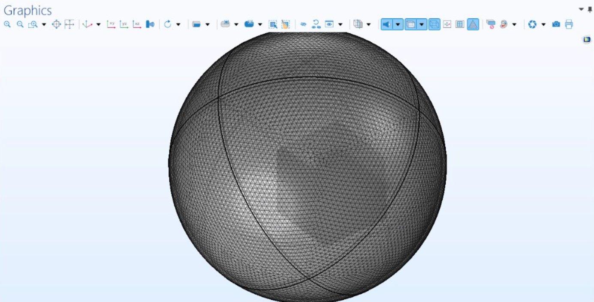

# 📢 Loudspeaker Design & Analysis


This project presents the **design, analytical modeling, and numerical simulation** of a midrange **moving coil loudspeaker**. The system is designed to reproduce speech and music in the 150 Hz – 5 kHz range with **controlled SPL**, **efficient diaphragm motion**, and **realistic cabinet modeling**.

---

## 🧰 Methodology

### 1. 📐 Mechanical & Electrical Design
- Designed key loudspeaker components: magnet, coil, diaphragm, spider, cabinet.
- Calculated **Thiele-Small Parameters** using Python scripts.

### 2. 🧮 Analytical Modelling (Python)
- Used numerical methods to compute SPL, impedance, displacement, and efficiency.
- Created graphs to visualize acoustic and electrical performance.

### 3. 📊 Numerical Simulation (COMSOL)
- Simulated magnetomechanics, pressure acoustics, and solid mechanics.
- Used Perfectly Matched Layers (PML) and mesh refinement to validate analytical results.

---

## 🎯 Design Specifications

| Parameter               | Value               | Unit         |
|------------------------|---------------------|--------------|
| **Diaphragm Material** | Polypropylene       | —            |
| **Magnet Type**        | Neodymium (B = 1 T) | —            |
| **Cabinet Volume**     | 6.91                | Litres       |
| **Diaphragm Area**     | 0.0154              | m²           |
| **Resonance Frequency**| 131.56              | Hz           |
| **BL Factor**          | 6.7                 | T·m          |
| **Total Stiffness**    | 7555.84             | N/m          |
| **Efficiency (Peak)**  | 3.5%                | —            |
| **Total Cost**         | £75                 | GBP          |

---

## 🧮 Analytical Calculations

All analytical computations are performed using Python based on standard electroacoustic formulas. Here's a breakdown of major formulas and results:

---

### 🎛️ 1. Voice Coil Design

- **Number of Turns:**  
```math
N = \frac{l_\text{coil} \times \text{layers}}{2 \times r_\text{wire}} = 533.3
```

- **Wire Length:**  
```math
l_\text{wire} = 2\pi \times r_\text{coil} \times N = 6.7 \, \text{m}
```

- **Mass of Voice Coil:**  
```math
M_\text{wire} = \frac{N \times (2 \times r_\text{coil}) \times \pi^2 \times (2 \times r_\text{wire})^2 \times \rho}{4} = 1.01 \, \text{g}
```

- **Electrical Resistance:**  
```math
R_E = \frac{4 \times r_\text{coil} \times l_\text{coil} \times \rho}{(2 \times r_\text{wire})^3} = 6.9 \, \Omega
```

- **Inductance:**  
```math
L_E = \frac{\mu_r \times \mu_0 \times N^2 \times \pi \times r_\text{coil}^2}{h_\text{coil}} = 0.561 \, \text{mH}
```

---

### 🪶 2. Diaphragm & Cabinet Calculations

- **Diaphragm Area:**  
```math
S_D = \pi \times r^2 = 0.0154 \, \text{m}^2
```

- **Cabinet Volume:**  
```math
V = H \times W \times D = 0.2 \times 0.192 \times 0.18 = 0.00691 \, \text{m}^3
```

- **Cabinet Stiffness:**  
```math
K_\text{cab} = \frac{\rho_0 \times c_0^2 \times S_D^2}{V} = 4755.84 \, \text{N/m}
```

- **Total Stiffness:**  
```math
K_T = K_\text{suspension} + K_\text{cab} = 2800 + 4755.84 = 7555.84 \, \text{N/m}
```

- **Diaphragm Mass:**  
```math
M_D = \rho \times S_D \times t = 10.1 \, \text{g}
```

- **Total Moving Mass:**  
```math
M_\text{MS} = M_D + M_\text{wire} = 11.11 \, \text{g}
```
---

### ⚙️ 3. Thiele-Small Parameters

| Parameter               | Value           |
|-------------------------|-----------------|
| Resonant Frequency (f_s)| 131.56 Hz       |
| Compliance (C_MS)       | 3.57×10⁻⁴ m/N   |
| Total Stiffness (K_T)   | 7555.84 N/m     |
| Moving Mass (M_MS)      | 11.11 g         |
| Force Factor (BL)       | 6.7 T·m         |
| Mechanical Q (Q_ms)     | 1.52            |
| Electrical Q (Q_es)     | 1.40            |
| Total Q (Q_ts)          | 0.73            |

---

### 🔊 4. Sound Pressure Level (SPL)

- **Pressure Formula:**  
```math
P(f) = \frac{\rho_0 \times \omega \times Q_v}{2\pi \times r}
```

- **SPL Formula:**  
```math
\text{SPL} = 20 \times \log_{10}\left(\frac{P}{20 \, \mu\text{Pa}}\right)
```

---

### 📉 5. Displacement Amplitude

- **Displacement:**  
```math
X(f) = \frac{Q_v}{j \times \omega \times S_D}
```

*Max displacement occurs below 150 Hz — controlled near resonance.*

---

### ⚡ 6. Electrical Impedance

- **Electrical Impedance:**  
```math
Z_E = R_E + j\omega L_E + \frac{(BL)^2}{Z_M}
```

- **Mechanical Impedance:**  
```math
Z_M = R_M + j\left(\omega M_\text{MS} - \frac{1}{\omega C_\text{MT}}\right)
```

---

### 🔋 7. Efficiency

- **Electroacoustic Efficiency:**  
```math
\eta_\text{EA} = \left(\frac{W_A}{W_E}\right) \times 100
```

Where:  
```math
W_A = \frac{|Q_v|^2 \times \text{Re}(Z_\text{acoustic})}{2}
```

```math
W_E = \frac{|I|^2 \times R_E}{2}
```

- **Peak:** 3.5%  
- **Midrange:** ~1.5%

## 📈 Visual Analysis

<table>
  <tr>
    <td align="center">
      <br/>
      <sub>SPL frequency range covering 5 Hz to 1500 kHz</sub>
    </td>
    <td align="center">
      <br/>
      <sub>Maximum displacement occurs <150 Hz, controlled at resonance</sub>
    </td>
  </tr>
  <tr>
    <td align="center">
      <br/>
      <sub>Peak impedance near resonance (14 Ω), nominal 8 Ω</sub>
    </td>
    <td align="center">
      <br/>
      <sub>Peaks at 3.5% near 131 Hz, ~1.5% midrange typical for sealed-box driver</sub>
    </td>
  </tr>
</table>

### ⚙️ Real & Imaginary Parts of Impedance

|  |
|:--:|
| *Figure: Real and imaginary parts of impedance — shows energy dissipation and phase behavior across frequency* |


## 🔍 Insights

### ✅ Strengths
- Flat **midrange SPL** (85 dB ±3 dB)
- **Controlled diaphragm excursion** for low distortion
- **Robust driver and magnet design**
- Affordable and simple **sealed cabinet**

### ⚠️ Limitations
- Low-frequency roll-off under 150 Hz (not suitable for bass)
- Lower efficiency compared to ported enclosures
- Sharp cabinet edges may cause diffraction

---

## 🏗️ Future Enhancements

- Use vented cabinet to improve bass response
- Optimize voice coil for higher BL product
- Apply **internal bracing and fillets** to reduce diffraction
- Replace polypropylene with **carbon fiber cone** for higher stiffness

---

## 🧪 COMSOL Simulation Dashboard

COMSOL Multiphysics was used to simulate the loudspeaker's vibroacoustic performance, including the interaction of the **moving coil**, **magnetic field**, and **sound radiation** into a free field using **PML boundaries**.

---

### 🧱 Geometry & Mesh

| Meshed Driver & Cabinet | Free Field Simulation |
|-------------------------|-------------------------------|
|  |  |

---

### 📊 Frequency Response Comparison

Red: Analytical | Green: Simulated

| Frequency Response |
|--------------------|
|  |
| *Figure: SPL comparison showing good match at mid-frequencies; 5 dB dip near 600 Hz due to antiresonance and cabinet damping.* |

---

### 📈 PML for Free Field

| PML Mesh |
|----------|
|  |
| *Figure: Simulated model with free field.* |

---

### 🔊 Acoustic Field & Radiation

| Sound Pressure Field | 
|---------------------------------------------|
<p align="center">
  
  <br/><i>SPL field emitted by cone into free field</i>
</p>

---

| Acoustic Directivity |
|----------------------|
| |
| *Figure: Directivity pattern showing front-biased radiation.* |

---

### 🪶 Mechanical Displacement

| Diaphragm Displacement |
|-------------------------------------------|
<p align="center">
  
  <br/><i>Peak displacement observed near resonant frequency</i>
</p>

---

### 📌 Summary

- ✅ **Mesh Control:** Refined in eddy-current and diaphragm zones
- ✅ **Frequency Domain Study:** 10–5000 Hz
- ✅ **Realistic Cabinet Material:** Spruce with Melamine Foam lining
- ✅ **Stiffness-Driven Anti-resonance** at 600 Hz

---

> 📁 *All images are stored in the `comsol/` folder for reference and reproducibility.*
